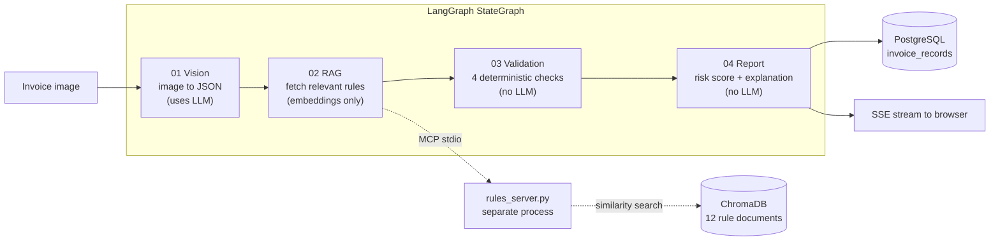

# Document Intelligence Agent

[](https://github.com/semaakyavuz/Document-Intelligence-Agent/actions/workflows/ci.yml)
[](https://sonarcloud.io/summary/new_code?id=semaakyavuz_Document-Intelligence-Agent)

**Live demo → https://document-intelligence-agent-rx07.onrender.com**

> The demo interface is in Turkish, because the system validates Turkish invoices — VAT
> rates, tax-number formats and price rules are Turkish. The codebase, this README and all
> identifiers are in English. You can try it without uploading anything of your own: the
> page ships with sample invoices and a one-click batch demo.

An end-to-end document intelligence system that reads an invoice image, extracts its
fields, checks them against a rule knowledge base, produces an explainable risk score, and
stores the result for later review.

## The problem

Accounts-payable teams check invoices by hand: does quantity times unit price match the
line total, is the VAT rate one that actually exists, is the tax number well-formed, is
this supplier suddenly charging three times its usual price? The work is repetitive, and
it is the kind of repetitive work where one missed digit costs real money.

OCR alone does not solve it. Reading the text off an invoice is only the first step — the
value is in *judging* what was read. This project separates those two concerns
deliberately: a vision model extracts, and **deterministic Python code decides**. No
anomaly verdict is delegated to an LLM, so every flag traces back to a rule you can read
in the source.

## Architecture

Four agents run in a fixed order as a LangGraph `StateGraph` (`app/graph.py`) — no
conditional branching, no retry loops. Each agent receives the shared `PipelineState`,
fills in the fields it owns, and passes it on.



| # | Agent | Responsibility | LLM? |
|---|-------|----------------|------|
| 01 | **Vision** (`app/agents/vision_agent.py`) | Sends the image to a vision-capable LLM, parses the JSON it returns | Yes |
| 02 | **RAG** (`app/agents/rag_agent.py`) | Builds a query from the extraction, retrieves matching rule documents | Embeddings only |
| 03 | **Validation** (`app/agents/validation_agent.py`) | Runs four rule classes over the extraction | No |
| 04 | **Report** (`app/agents/report_agent.py`) | Computes the risk score, writes the explanation, assembles `final_report` | No |

**The RAG step runs out of process.** `app/mcp/rules_server.py` is launched as an
independent **MCP stdio subprocess** through the official `mcp` SDK, and the agent talks to
it as a client. Retrieval — embedding the query, searching ChromaDB — lives entirely on the
server side, so the rule store can be swapped or reused by another MCP client without
touching the pipeline.

**Validation is plain Python**, four single-purpose classes:

| Checker | What it enforces |
|---------|------------------|
| `MathConsistencyCheck` | quantity x unit price = line total; line total x VAT rate = VAT amount; sum of lines = subtotal; subtotal + VAT = grand total (0.01 rounding tolerance) |
| `VatRateCheck` | Every line's VAT rate is one of 1%, 10%, 20% |
| `FormatCheck` | Invoice and tax numbers are present and well-formed. Two profiles: `strict_tr` (exactly 10 digits) and `lenient` (the default, so foreign invoice formats are not flagged as anomalies) |
| `PriceRangeCheck` | Unit price falls inside the range stated by the retrieved rule document |

**Risk scoring** is a formula, not a model: start at 100, subtract 15 per anomaly, floor at
0. No anomalies gives `passed`; a score of 40 or above gives `review_required`; below that,
`rejected`. If Vision produced nothing at all the result is `rejected` at 0 — nothing could
be verified, which is not the same as passing.

## Measured results

Every number below comes from evaluation reports committed under `data/` or from the test
suite in this repository. The vision model was `gemini-3.5-flash-lite` in all runs.

### Real-world invoices (Kaggle)

985 real invoice images were queued. **502 completed**; the other 483 stopped on the Gemini
free-tier daily quota (HTTP 429) and were never processed. The table counts only the 502
that actually ran — a failed API call says nothing about extraction accuracy.

| Field | Correct | Accuracy |
|-------|---------|----------|
| Invoice number | 502 / 502 | 100 % |
| Invoice date | 502 / 502 | 100 % |
| Seller name | 502 / 502 | 100 % |
| Buyer name | 502 / 502 | 100 % |
| VAT total | 502 / 502 | 100 % |
| Subtotal | 491 / 502 | 97.8 % |
| Grand total | 491 / 502 | 97.8 % |
| Line items (whole list, exact) | 358 / 502 | 71.3 % |
| **Overall, 8 fields** | **3850 / 4016** | **95.9 %** |

Line items are scored strictly: the entire list must match element by element, so one wrong
`vat_amount` on a five-line invoice fails the whole field.

An earlier, smaller run over 174 images completed with **no** provider errors and scored
**95.5 %** overall (`data/real_world_test/eval_report.json`), consistent with the larger
run. Tax number is excluded throughout — the Kaggle labels never contain one.

### Synthetic invoices

Generated with `scripts/generate_invoices.py`, then degraded with
`scripts/augment_invoices.py` — rotation, perspective, Gaussian blur and
brightness/contrast shifts, plus print and scan artefacts (low ink, paper noise, stains,
dirty rollers, cast shadows) — to approximate photographed and scanned documents.

| Set | Images | Overall accuracy |
|-----|--------|------------------|
| `data/golden` | 15 | 100 % |
| `data/golden_classic` | 15 | 100 % |
| `data/golden_mixed` (augmented) | 15 | 97.0 % |

### Tests and coverage

```
357 tests collected — 346 passed, 8 skipped, 3 slow deselected
Coverage (app/): 97 %  — 1039 statements, 28 missed
```

Across 19 test files. Tests never reach an external service: providers are faked and the
database is SQLite. The only exceptions are tests marked `@pytest.mark.slow` — real Ollama,
a real MCP stdio subprocess, a real PostgreSQL container — which CI deselects. Pushes and
pull requests to `main` run Ruff, the suite with coverage, and a SonarCloud analysis
(`.github/workflows/ci.yml`).

## Tech stack

| Layer | Choice |
|-------|--------|
| Language | Python 3.12 |
| Orchestration | LangGraph (`StateGraph`) |
| Tool protocol | MCP, official Python SDK — rule server as a stdio subprocess |
| Vector store | ChromaDB, local and persisted |
| LLM / embeddings | Gemini (`google-genai`) or Ollama, selected in `.env` via `app/providers/factory.py` |
| API | FastAPI, with Server-Sent Events for live pipeline progress |
| Database | PostgreSQL through SQLAlchemy 2.0 + psycopg 3 (Neon in the cloud, Docker locally) |
| Config | Pydantic Settings — every setting flows through `Settings`, nothing else reads the environment |
| Frontend | Vanilla JS, CSS and Chart.js. No framework, no build step |
| Quality | Ruff, pytest + coverage, SonarCloud, GitHub Actions |

### HTTP endpoints

| Endpoint | Purpose |
|----------|---------|
| `GET /` | The application page |
| `GET /health` | Liveness check; deliberately does not touch the database |
| `POST /invoices` | Process one invoice, return the full report |
| `POST /invoices/stream` | The same, streamed step by step over SSE |
| `POST /invoices/bulk` | Up to 10 invoices, processed sequentially, streamed over SSE |
| `GET /invoices`, `GET /invoices/{id}` | Stored results, used by the dashboard |

## Running it locally

Requirements: Python 3.12, Docker for PostgreSQL, and an API key for whichever LLM provider
you pick.

```bash
python -m venv .venv
.venv/Scripts/activate                # Linux/macOS: source .venv/bin/activate
pip install -r requirements-dev.txt   # pulls in the runtime requirements too

cp .env.example .env                  # then fill in the provider and API key
```

`.env.example` documents every setting, including why each default was chosen.

```bash
docker compose up -d                  # PostgreSQL 16 on 127.0.0.1:5434
uvicorn app.api.main:app --reload
```

Open http://127.0.0.1:8000 — the dashboard lives at `/static/dashboard.html`.

The knowledge base is indexed automatically at startup if the ChromaDB collection is
missing, empty, or was built with a different embedding provider or model
(`app/rag_index.py`). That last check matters: Ollama and Gemini vectors share a dimension
but not a meaning, so an unnoticed provider switch would quietly return irrelevant rules
instead of failing.

Tests and linting:

```bash
pytest -m "not slow"    # what CI runs; touches no external service
pytest                  # adds the slow tests: real Ollama, real MCP subprocess
ruff check .
```

Useful scripts in `scripts/`: `generate_invoices.py` (synthetic data),
`augment_invoices.py` (image degradation), `evaluate_vision_agent.py` (accuracy reports),
`index_knowledge_base.py`, and `run_pipeline_manual.py` (run the pipeline without the API).

Before merging a change, walk through [`CODE_REVIEW_CHECKLIST.md`](CODE_REVIEW_CHECKLIST.md).

## Known limitations

Stated plainly, because a portfolio project that hides them is less useful than one that
does not.

- **Turkish diacritics occasionally drift.** The model sometimes normalises them away or
  picks the wrong letter. Two of the four mismatches in the augmented synthetic set are
  exactly this: `Ülker Ltd.` read as `Ulker Ltd.`, and `Hayrioğlu Tarhan San.` read as
  `Hayrıoğlu Tarhan San.` Both are legible to a human and wrong to a string comparison.
- **`temperature=0` is not determinism.** `Settings.LLM_TEMPERATURE` defaults to `0.0`,
  which makes runs more repeatable, but the provider offers no guarantee that identical
  input produces identical output. Treat extraction as non-deterministic.
- **Line-item accuracy, 71.3 %, is the weakest field** and the honest ceiling of the system
  today. Most failures are a missing or miscomputed `vat_amount` on one line rather than a
  misread product.
- **The real-world evaluation is incomplete.** 502 of 985 images finished; the rest hit the
  Gemini free-tier daily quota. The reported accuracy covers only what actually ran.
- **At most two analyses run at once.** `Settings.MAX_CONCURRENT_PIPELINES` defaults to 2
  because every in-flight request spawns its own MCP subprocess of roughly 119 MB. Measured
  in a 512 MB container: with the limit in place, 3 concurrent requests peaked at 283 MiB
  and 4 at 386 MiB; without it, 4 concurrent requests were killed by the OOM killer. Excess
  requests are not rejected — they queue, and the browser shows a "waiting in queue" notice.
  Raise the setting on a larger plan.
- **Free-tier hosting sleeps.** Render spins the service down after roughly 15 minutes of
  inactivity, and its disk is ephemeral, so waking it also re-indexes the knowledge base.
  Measured on the live demo after a 16-minute idle: the first request took **52 s**, all of
  it waiting for the first byte (the TCP connection was accepted in 0.1 s, so the delay is
  the container starting, not the network). The very next request took 0.18 s. Warm, the
  page consistently answers in 0.16–0.30 s. If the demo link seems dead, it is asleep —
  give it a minute.
- **The Groq provider is a stub.** `GroqLLMProvider.generate()` raises
  `NotImplementedError`. Gemini and Ollama are implemented and tested.
- **No migrations.** `init_db()` calls `create_all()`, which is enough for this project's
  single table; a schema change in production would need something like Alembic.
- **The rules are a curated demo set**, not Turkish tax law: 12 documents covering VAT
  rates, number formats, total checks and typical price ranges for office supplies.

## Credits

Real-world invoice images come from the Kaggle dataset
[High-Quality Invoice Images for OCR](https://www.kaggle.com/datasets/osamahosamabdellatif/high-quality-invoice-images-for-ocr)
by *osamahosamabdellatif*, published under the
[Open Database License (ODbL)](https://opendatacommons.org/licenses/odbl/1-0/). Labels were
converted for this project with `scripts/convert_kaggle_labels.py`.
